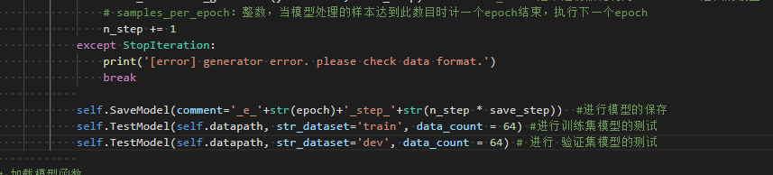

语音
各个模型的作用

251、521模板、521_test都是原始的模型,作用就是DFCNN+全连接 有输出测试文件,每次测试的是64个,这里测试的是dev跟train的数据集

252是修改了251的优化器

251_p,261_p暂时没看,不重要

261添加了双向的GRU

271 双向的LSTM损失函数无法下降

281 单向的LSTM损失函数无法下降

291 在251基础上添加双向的GRU

